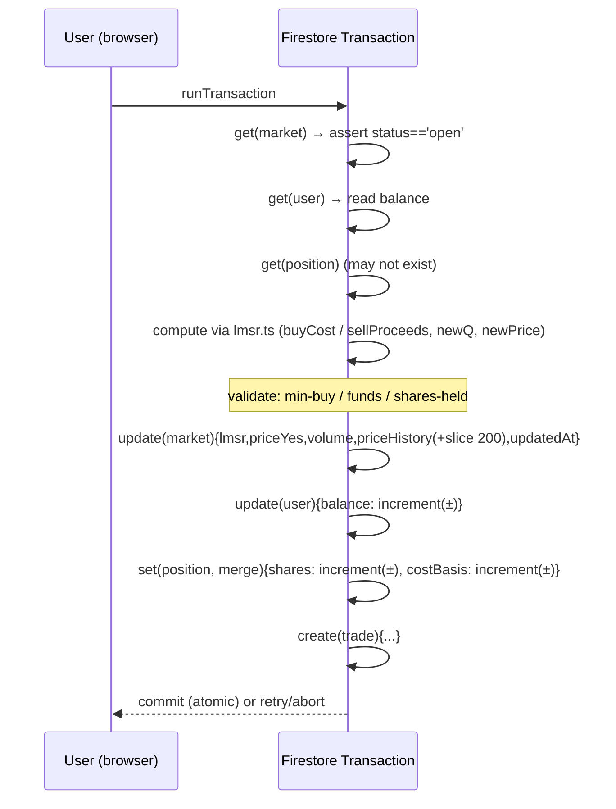
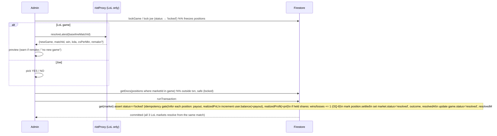
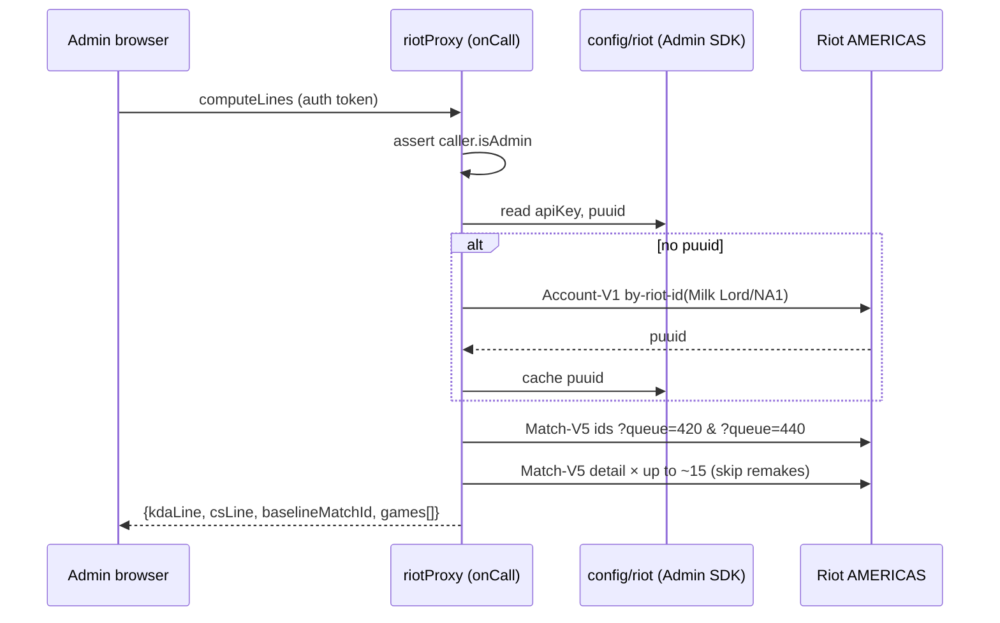

# Milk Market — Technical Plan (`plan.md`)

> **Status:** PHASE 2 (PLAN). Builds on the approved [`spec.md`](./spec.md).
> **Audience:** the implementer (future me) + you for sign-off.
> This document fixes architecture, schema, formulas, security, the Riot flow, libraries, and the
> file layout. The task breakdown is in [`tasks.md`](./tasks.md).

---

## 0. Decisions & Deviations (read this first)

You approved PHASE 1 without changing the open questions, so **all 15 OQ defaults from `spec.md`
§12 are now in force**. They're restated in [§13](#13-open-question-resolutions-applied). Two items
deserve to be called out before anything else:

### ⚠️ D-0.1 — "Sell at exactly mid price" enables a risk-free money pump. I'm defaulting to the fair-value sell.

This is the only place I'm refining a *locked* decision, and I'm doing it out loud rather than
silently. The math (worked example in [§7.4](#74-the-money-pump-and-why-sell-mode-defaults-to-lmsr)):

- LMSR **buys** cost the *integral* of price over the move — i.e. the **average** price across the
  jump. Buy 50 YES from 50¢ and you pay ~54¢/share, ending at 58¢.
- If **selling** pays the **post-buy mid (58¢)** for all 50 shares, you collect more than you paid
  and end flat → **free money, repeatable infinitely.** That mints unbounded cash and breaks the
  leaderboard (this is different from the benign "money doesn't conserve / drifts" note in the prompt).

**Resolution:** I implemented selling as a single constant `SELL_MODE` in one file:
- `SELL_MODE = 'lmsr'` **(default)** — proceeds = `C(before) − C(after)`. Fee-free, no spread, and
  for *small* sells the per-share price ≈ the current mid (so it honors the *intent* of "sell at
  mid, no fee"), while being immune to the pump.
- `SELL_MODE = 'mid'` — the literal "shares × current mid" behavior, **pump and all**, if you decide
  the exploit is acceptable among friends.

It's a one-character change to switch. **My recommendation: keep `'lmsr'`.** Please veto if you truly
want literal mid. (This is logged here and in `spec.md` so we never silently diverge.)

### D-0.2 — Schema refinement: a `games/{gameId}` doc.

The prompt put `gameId` on each market. I'm adding a small **client-readable** `games/{gameId}` doc
to centralize a LoL game's lifecycle (status, the two lines, and the `baselineMatchId` for the
stale-match guard, OQ-12). The three markets still carry `gameId`. This makes "one active game at a
time" (OQ-11) and "open new game disabled until resolved" trivial to enforce and display. See
[§5](#5-firestore-schema-exact).

### D-0.3 — Post-approval changes (Joe markets) — requested during Phase 4

1. **Multiple Joe markets per PST day** (reverses OQ-13). `createJoe` no longer checks for an existing
   same-day market; `dayPST` is kept for display only. The `markets (category, dayPST)` composite index
   is now unused (left deployed; harmless).
2. **Admin-set starting price for Joe markets.** `createJoe(text, initialPriceCents=50)` seeds the
   LMSR so the market opens at the chosen YES price (1–99¢) and **still moves normally** as people
   trade. Implemented by `initialQForPrice()` in `lib/lmsr.ts`: it sets a virtual `(qYes,qNo)` offset
   so `priceYes = initial`. This offset is **not** backed by user shares — fine, because LMSR is valid
   for any real `q`, the invariant that matters (a user can't sell more than they personally hold) is
   unaffected, and money already isn't conserved (BR-15). LoL markets still start at 50¢.

### D-0.4 — Editable tracked LoL player (post-approval)

The tracked Riot ID is no longer a fixed constant. It lives in a **client-readable `meta/tracked`**
doc `{ gameName, tagLine }` (rules: read = signed-in, write = admin), editable from **Admin → "Tracked
LoL player"**. The Cloud Function reads `meta/tracked` and resolves the puuid **fresh on each call**
(no cache to invalidate; one extra Account-V1 request per op). `TRACKED_PLAYER` in `constants.ts` is
now only the default/fallback. The Win-market title uses the current tracked name. Switching players
is **blocked while a LoL game is open/locked** (its markets + `baselineMatchId` belong to the prior
player — resolve first). `config/riot` now holds just the secret `apiKey` (player moved out, puuid no
longer cached). Initial value: **Drogo400#NA1**.

### D-0.5 — History view + admin delete (post-approval)

1. **Live vs History on the home page.** Open/locked markets show in their category sections; resolved
   markets are grouped under a separate **"History"** section (spec AC-C1.6). The "active LoL game" is
   the latest game only while its status ≠ resolved.
2. **Admin "History cleanup".** New `deleteMarketCascade(marketId)` / `deleteGameCascade(game)` in
   `lib/markets.ts` delete a resolved market (or a game's 3 markets + game doc) **plus their positions
   and trades**, in chunked `writeBatch`es. Guarded to resolved-only. **Record-only deletion** — it
   does NOT reverse payouts; `balance` / `realizedProfit` / `wins` / `losses` are cached on user docs
   and untouched (consistent with no-void, BR-14).
3. **Rules change:** `positions` and `trades` now allow `delete: if isAdmin()` (were `false`) to permit
   the cascade. Everything else unchanged. Redeployed.

### D-0.6 — Theme system (light/dark) + interactive chart (post-approval)

1. **Token-driven theming.** `tailwind.config.ts` uses `darkMode: 'class'`, and `ink`/`paper` are now
   `rgb(var(--ink|--paper) / <alpha-value>)`. `index.css` sets the channel vars in `:root` (light) and
   `.dark`. Because nearly every surface/text/border already uses `bg-paper` / `text-ink` / `*-ink/NN`,
   the whole app flips with **no per-element churn**; only the colored tints (`yes/no` soft pills,
   `milk` accents) and fixed scrims got targeted `dark:` variants. Modal overlays use fixed `bg-black/*`
   (a scrim must stay dark in both themes), and saturated yes/no/gradient buttons use fixed `text-white`.
2. **ThemeProvider** (`hooks/useTheme.tsx`): state persisted to `localStorage('mm_theme')`, defaults to
   `prefers-color-scheme`, toggled from the nav (sun/moon). A tiny **inline script in `index.html`**
   applies the `.dark` class before paint to avoid a flash.
3. **Gradient backgrounds** set on `body` (and `.dark body`): a milky cream base with soft indigo+mint
   blooms in light; a deep slate version in dark.
4. **Interactive PriceChart** (`components/PriceChart.tsx`): dependency-free SVG with a labeled Y axis
   (0–100¢ + gridlines), time labels on the X axis, and a hover crosshair + tooltip (nearest-point by
   mouse x). Aspect-locked container so hover maps exactly; theme-aware via `currentColor`/`*-ink/NN`.

### D-0.7 — Position indicators (Kalshi-style) (post-approval)

`Home` passes each viewer's live position (from `usePositions`, filtered to shares > 0 & `!settled`)
into `MarketCard`, which renders a "You hold N YES/NO" chip. `MarketDetail` shows a prominent
**"Your position"** banner — shares held, current mark-to-market value, and **unrealized P&L**
(`value − costBasis`, colored) — shown only for active (non-resolved) holdings. Pure display; no new
data model or rules.

### D-0.9 — Selectable LoL markets + de-"Milk Lord" (post-approval)

`openGame(lines, baselineMatchId, selection)` takes a `{win, kda, cs}` selection and creates only the
chosen markets; `GameDoc.marketIds` fields are now **optional**, and `lockGame`/`resolveGame`/
`deleteGameCascade` skip absent ones. The admin card shows three toggles (≥1 required) with a tip to
skip CS/min for support/jungle. The open-game blurb now uses the live tracked Riot ID (`useTracked`)
instead of the hardcoded "Milk Lord"; the onboarding example and resolve copy were de-gendered/
genericized too. No schema migration needed (additive/optional).

### D-0.8 — Portfolio: average buy price (post-approval)

Each open-position row on the Portfolio page now shows **"Bought X¢"** = `costBasis / (yesShares +
noShares) × 100` (for the common one-sided position this is exactly the entry price; after partial
sells it's the cost basis of the remaining shares), alongside the current side price and unrealized
P&L. Derived from the existing `costBasis` field — no schema change. Theme-aware pills.

---

## 1. Architecture Overview

```mermaid
flowchart LR
  subgraph Browser["Browser (static SPA — GitHub Pages)"]
    UI["React + Vite + Tailwind"]
    LMSR["LMSR engine (client)"]
    TX["Firestore transactions\n(buy / sell / resolve)"]
  end

  subgraph Firebase
    AUTH["Firebase Auth\n(email/password)"]
    FS[("Firestore\nusers · markets · games\npositions · trades · config")]
    FN["Cloud Function (Blaze)\nriotProxy — onCall\nADMIN-only"]
  end

  RIOT["Riot API\nAccount-V1 · Match-V5\n(AMERICAS routing)"]

  UI -->|login| AUTH
  UI <-->|onSnapshot reads + tx writes| FS
  LMSR --> TX --> FS
  UI -->|callable: computeLines / resolveLatest| FN
  FN -->|reads apiKey+puuid via Admin SDK\n(bypasses rules)| FS
  FN -->|X-Riot-Token| RIOT
  RIOT --> FN --> UI

  classDef secret fill:#fee,stroke:#c00;
  class FN,RIOT secret;
```

**Key boundaries**
- **All money logic is client-side** inside Firestore transactions (buy/sell) or a transaction-backed
  batch (resolve). The Cloud Function never touches balances (constraint C-7).
- **The Cloud Function does Riot only.** It is the sole holder of the Riot key (read from
  `config/riot` via Admin SDK, which bypasses security rules) and the only thing that talks to Riot.
- **Secrets never reach the browser.** `config/*` is read-denied to clients; the function returns only
  *derived numbers* (lines, win/kda/cs), never the key or raw tokens.

---

## 2. Tech Stack & Libraries

| Concern | Choice | Why |
|---|---|---|
| Build/SPA | **React 18 + Vite + TypeScript** | Fast, static-friendly, GH Pages target. |
| Styling | **Tailwind CSS** (+ a tiny token layer) | Kalshi look without a heavy component lib. |
| Routing | **React Router (`HashRouter`)** | GH Pages serves static files; hash routing avoids 404s on refresh/deep-links without a custom 404 fallback. |
| Firebase | **firebase JS SDK v10 (modular)** — `auth`, `firestore`, `functions` | Official, tree-shakeable. |
| Live data | **Firestore `onSnapshot`** via custom hooks | Prices/markets update live as friends trade; no polling. |
| Charts | **Hand-rolled SVG sparkline** (no chart dep) | Small bundle, clean line, matches Kalshi minimalism. |
| Icons | **lucide-react** | Light, crisp. |
| Cloud Function | **Node 20 + `firebase-functions` v2 `onCall`** + `firebase-admin`; global `fetch` | One callable, admin-gated. Key stays in Firestore (no redeploy on rotation). |
| Seed | **`firebase-admin`** script (Node, ESM) | Creates the 11 auth users + docs; bypasses rules. |
| Deploy (web) | **GitHub Actions → GitHub Pages** (+ `gh-pages` fallback) | Static deploy from `/web/dist`. |
| Deploy (fn/rules) | **Firebase CLI** | `firebase deploy --only functions,firestore:rules,firestore:indexes`. |
| Unit tests | **Vitest** (LMSR engine + time/money helpers) | The math must be provably correct. |

No state-management library (Context + snapshot hooks suffice). No data-grid library (the leaderboard
is 11 rows).

---

## 3. Folder / File Structure

```
e:\Frog Pad Kalshi\
├─ specs/
│  ├─ spec.md  ├─ plan.md  └─ tasks.md
├─ web/                              # React + Vite SPA  (GH Pages root)
│  ├─ index.html
│  ├─ vite.config.ts                 # base: '/<repo>/' (or '/'), build → dist
│  ├─ tailwind.config.ts  postcss.config.js
│  ├─ package.json
│  └─ src/
│     ├─ main.tsx  App.tsx  routes.tsx
│     ├─ config/
│     │  └─ constants.ts              # SINGLE SOURCE: b, MIN_BUY, USERS, TRACKED_PLAYER, SELL_MODE, firebase web config…
│     ├─ lib/
│     │  ├─ firebase.ts               # init app; export auth, db, functions
│     │  ├─ lmsr.ts                   # PURE math: price, cost, buyCost, sellProceeds, mtm
│     │  ├─ money.ts                  # formatting + currency (🥛)
│     │  ├─ time.ts                   # PST day boundary + date display
│     │  ├─ riot.ts                   # callable wrappers: computeLines(), resolveLatest()
│     │  ├─ trades.ts                 # buyShares(), sellShares()  (transactions)
│     │  ├─ markets.ts                # openGame(), lockGame(), resolveGame(), createJoe(), resolveJoe()
│     │  └─ leaderboard.ts            # derive bankroll/realized/W-L from snapshots
│     ├─ hooks/
│     │  ├─ useAuth.ts  useUser.ts  useMarkets.ts  useMarket.ts  usePositions.ts  useAllUsers.ts
│     ├─ components/
│     │  ├─ ui/ (Button, Card, Badge, Modal, Tabs, PriceTag, NumberInput, Spinner)
│     │  ├─ Nav.tsx  ProtectedRoute.tsx  AdminRoute.tsx
│     │  ├─ MarketCard.tsx  TradePanel.tsx  PriceChart.tsx  PositionRow.tsx
│     │  └─ HowItWorks.tsx
│     └─ pages/
│        ├─ Login.tsx  Home.tsx  MarketDetail.tsx  Portfolio.tsx  Leaderboard.tsx  Admin.tsx
├─ functions/                         # the ONE Cloud Function
│  ├─ package.json
│  └─ index.js                        # riotProxy onCall (computeLines / resolveLatest), admin-gated
├─ scripts/
│  └─ seed.mjs                        # create 11 auth users + users/{uid} docs, set isAdmin
├─ firebase.json                      # functions + firestore (rules, indexes). NOT hosting.
├─ .firebaserc
├─ firestore.rules
├─ firestore.indexes.json
├─ .github/workflows/deploy-pages.yml # build web → deploy to GH Pages
├─ .gitignore                         # node_modules, dist, serviceAccountKey.json, .env*
└─ README.md
```

> **What is committed vs. not:** Firebase **web** config is committed (constant in `constants.ts`).
> The Riot key, the Admin SDK **service-account JSON** (used only by `seed.mjs` locally), and any
> `.env` are **git-ignored**. Riot key appears only as `RGAPI-XXXX...` placeholder.

---

## 4. Single-Source Constants (`web/src/config/constants.ts`)

```ts
// ——— Firebase web config (SAFE to commit) ———
export const FIREBASE_CONFIG = {
  apiKey: "AIza...", authDomain: "...", projectId: "...",
  appId: "...", /* etc. */
};

// ——— Economy / market mechanism ———
export const LMSR_B = 150;                 // liquidity, the ONLY place b is defined
export const MIN_BUY = 10;                 // min cash cost of a buy (OQ-1)
export const STARTING_BALANCE = 1000;
export const SELL_MODE: 'lmsr' | 'mid' = 'lmsr';   // see plan §0.1 / §7.4

// ——— People ———
export const USERS = ['Jacob','Ethan','Don','Nick','Rhett','Nate','Victor','Joe','Philippe','Abe','Praneeth'] as const;
export const EMAIL_DOMAIN = 'milkmarket.local';
export const ADMIN_DISPLAY_NAME = 'Victor';   // gets isAdmin in seed

// ——— LoL / Riot ———
export const TRACKED_PLAYER = { gameName: 'Milk Lord', tagLine: 'NA1' };
export const RANKED_QUEUES = [420, 440] as const;       // solo + flex
export const LINE_SAMPLE_SIZE = 10;
export const MIN_GAME_SECONDS = 300;                    // remake filter (OQ-4)

// ——— Presentation ———
export const CURRENCY = { symbol: '🥛', name: 'Milk', minorPlaces: 2 };
export const PACIFIC_TZ = 'America/Los_Angeles';        // OQ-9
```

The Cloud Function keeps its **own** copies of `RANKED_QUEUES`, `LINE_SAMPLE_SIZE`,
`MIN_GAME_SECONDS`, and the rounding rule (it can't import from `web/`). `LMSR_B`, `MIN_BUY`,
`SELL_MODE` are **client-only** (the function does no money math).

---

## 5. Firestore Schema (exact)

> Types: `ts` = epoch millis (number) unless noted. Money/shares are JS numbers (floats); we round
> only for display. Booleans/strings as marked.

### `users/{uid}`  — world-readable to signed-in users (leaderboard)
```
displayName    : string            // e.g. "Jacob"
email          : string            // "jacob@milkmarket.local"
balance        : number            // cash; starts 1000
isAdmin        : boolean           // true only for Victor; CLIENT-IMMUTABLE
realizedProfit : number            // cached leaderboard stat; starts 0; only resolution writes it
wins           : number            // resolved markets netted positive (held at resolution); starts 0
losses         : number            // resolved markets netted negative (held at resolution); starts 0
createdAt      : ts
```

### `markets/{marketId}`  — world-readable to signed-in users
```
title       : string
category    : 'lol_win' | 'lol_kda' | 'lol_cs' | 'joe'
status      : 'open' | 'locked' | 'resolved'
gameId      : string | null        // groups the 3 LoL markets; null for Joe
line        : number | null        // KDA / CS line; null for win & joe
lmsr        : { qYes: number, qNo: number, b: number }   // b copied from LMSR_B at creation
priceYes    : number               // cached cents (float, e.g. 58.26); = 100 · price(qYes,qNo,b)
volume      : number               // cumulative cash traded (display only); starts 0
priceHistory: { t: ts, y: number }[]   // capped to last 200 points; y = priceYes cents
outcome     : 'YES' | 'NO' | null
dayPST      : string | null        // 'YYYY-MM-DD' Pacific; set for joe (and lol for display)
createdAt   : ts
resolvedAt  : ts | null
```

### `games/{gameId}`  — world-readable to signed-in users (D-0.2)
```
gameId          : string           // also the doc id
status          : 'open' | 'locked' | 'resolved'
kdaLine         : number
csLine          : number
baselineMatchId : string           // most-recent match id at open time (stale guard, OQ-12)
resolvedMatchId : string | null
marketIds       : { win: string, kda: string, cs: string }
createdAt       : ts
resolvedAt      : ts | null
```

### `positions/{uid}_{marketId}`  — readable by all signed-in users (needed for leaderboard MTM)
```
uid        : string
marketId   : string
yesShares  : number                // ≥ 0
noShares   : number                // ≥ 0
costBasis  : number                // net cash invested: += buyCost, −= sellProceeds
settled    : boolean               // set true at resolution
createdAt  : ts
updatedAt  : ts
```
> We **keep** position docs at 0 shares (do not delete on full exit) so resolution can still book
> realized P&L from pre-resolution trading. Portfolio lists only `yesShares+noShares > 0 && !settled`.

### `trades/{autoId}`  — readable by all signed-in users; append-only
```
uid         : string
marketId    : string
side        : 'YES' | 'NO'
action      : 'BUY' | 'SELL'
shares      : number
cost        : number               // +cash out for BUY, +cash in for SELL (store magnitude + action)
priceBefore : number               // cents
priceAfter  : number               // cents
ts          : ts
```

### `config/riot`  — **SERVER-ONLY**: clients cannot read; only admin may write; function reads via Admin SDK
```
apiKey   : string   // "RGAPI-XXXX..." placeholder until admin sets the real one
puuid    : string   // resolved & cached by the function from Account-V1
gameName : "Milk Lord"
tagLine  : "NA1"
```
`config/trackedPlayer` is **merged into `config/riot`** (prompt allowed this).

**Indexes (`firestore.indexes.json`):**
- `positions` — composite `(marketId ASC)` for resolution holder lookup; `(uid ASC)` for portfolio.
- `markets` — composite `(status ASC, createdAt DESC)` and `(category ASC, dayPST DESC)` for home/Joe.
- `trades` — `(marketId ASC, ts ASC)` if we ever rebuild a chart from trades (chart uses
  `priceHistory` by default, so this is optional).

---

## 6. Security Rules Strategy (`firestore.rules`)

Principles: signed-in users can **read** markets/games/users/positions/trades; **secrets are
read-denied to everyone**; **`isAdmin` is client-immutable**; admin actions are enforced server-side;
ordinary trade writes are allowed but constrained to non-malicious shapes (cheating out of scope, but
we still lock the dangerous fields).

```js
rules_version = '2';
service cloud.firestore {
  match /databases/{db}/documents {

    function signedIn() { return request.auth != null; }
    function isAdmin() {
      return signedIn() &&
        get(/databases/$(db)/documents/users/$(request.auth.uid)).data.isAdmin == true;
    }
    function changed(keys) {            // request changes exactly these keys (subset allowed)
      return request.resource.data.diff(resource.data).affectedKeys().hasOnly(keys);
    }
    function unchanged(field) {
      return request.resource.data[field] == resource.data[field];
    }

    match /users/{uid} {
      allow read: if signedIn();
      allow create: if false;                          // seed via Admin SDK only
      allow update: if signedIn()
        && unchanged('isAdmin') && unchanged('email') && unchanged('displayName')
        && (
          // self: only cash moves (own buy/sell)
          (request.auth.uid == uid && changed(['balance','updatedAt']))
          // admin: resolution updates cash + cached stats on any user
          || (isAdmin() && changed(['balance','realizedProfit','wins','losses','updatedAt']))
        );
      allow delete: if false;
    }

    match /markets/{m} {
      allow read: if signedIn();
      allow create, delete: if isAdmin();
      allow update: if isAdmin()                        // lock / resolve / create-time
        || (                                            // a trade: market stays open, only trade fields move
            resource.data.status == 'open'
            && request.resource.data.status == 'open'
            && changed(['lmsr','priceYes','volume','priceHistory','updatedAt'])
        );
    }

    match /games/{g} {
      allow read: if signedIn();
      allow write: if isAdmin();
    }

    match /positions/{pid} {
      allow read: if signedIn();
      allow create: if signedIn()
        && request.resource.data.uid == request.auth.uid;          // own position on buy
      allow update: if signedIn()
        && (resource.data.uid == request.auth.uid || isAdmin());   // own trade, or admin resolution
      allow delete: if false;
    }

    match /trades/{t} {
      allow read: if signedIn();
      allow create: if signedIn() && request.resource.data.uid == request.auth.uid;
      allow update, delete: if false;                              // append-only
    }

    match /config/{doc} {
      allow read: if false;          // NOBODY reads via client (function uses Admin SDK, bypasses rules)
      allow write: if isAdmin();     // admin pastes the rotated key
      // note: read:false is what keeps the Riot key off the client (AC-J2.1)
    }
  }
}
```

> **Honesty note on the trade-write rules:** these constrain *which fields* a trade may touch and keep
> `status`/`isAdmin`/secrets locked, but — by design (C-7) — they do **not** verify the LMSR math or
> that `balance` only dropped by the correct `cost`. A determined user could write a wrong balance.
> That is the accepted trade-off for "cheating is not a concern." If that ever changes, the only fix is
> to move money logic into a Cloud Function — explicitly out of scope for v1.

---

## 7. LMSR Math (the contract for `lib/lmsr.ts`)

Binary market, two share quantities `qYes, qNo ≥ 0`, liquidity `b` (=150). Invariant:
`qYes = Σ users' yesShares` and `qNo = Σ users' noShares` (so neither can go negative — you can only
sell what you hold).

### 7.1 Price & cost (numerically stable)
```
priceYes(qYes,qNo,b) = 1 / (1 + exp((qNo − qYes)/b))      // sigmoid; in [0,1]
priceNo  = 1 − priceYes
displayCents = round(100 · priceYes)                      // UI only; store float

cost C(qYes,qNo,b):
  m = max(qYes,qNo)
  C = b · ( m/b + ln( exp((qYes−m)/b) + exp((qNo−m)/b) ) )   // log-sum-exp, overflow-safe
```

### 7.2 Buy `shares` of `side` (always integral cost; moves price up)
```
qAfter = side==YES ? (qYes+shares, qNo) : (qYes, qNo+shares)
buyCost = C(qAfter) − C(qBefore)            // > 0, convex
reject if buyCost < MIN_BUY                  // OQ-1
reject if buyCost > user.balance
priceAfterYes = 100 · priceYes(qAfter)
```

### 7.3 Sell `shares` of `side`
```
require shares ≤ user's held shares on that side
qAfter = side==YES ? (qYes−shares, qNo) : (qYes, qNo−shares)

if SELL_MODE == 'lmsr':                       // DEFAULT — fee-free, pump-proof
   proceeds = C(qBefore) − C(qAfter)          // exact reversal of a buy
else /* 'mid' */:                             // literal "mid price", pump risk
   midCents = side==YES ? priceYes·100 : (1−priceYes)·100
   proceeds = shares · midCents/100

priceAfterYes = 100 · priceYes(qAfter)
```

### 7.4 The money pump (why `SELL_MODE` defaults to `'lmsr'`)
Worked, `b=150`, start `qYes=qNo=0` (50¢):
- **Buy 50 YES:** `C(50,0)−C(0,0) = 131.04 − 103.97 = 27.07`. Price → **58.26¢**.
- **Sell 50 YES, mode `'mid'`:** `50 × 0.5826 = 29.13`. Net **+2.06**, back to flat, price back to 50¢
  → **repeat forever.** ❌
- **Sell 50 YES, mode `'lmsr'`:** `C(50,0)−C(0,0) = 27.07`. Net **0.00**. ✅ No pump; small sells still
  realize ≈ the current mid.

### 7.5 Mark-to-market & resolution
```
MTM(position) = yesShares · priceYes + noShares · priceNo        // money units (each share → 1.00)
payout(position, outcome) = (outcome==YES ? yesShares : noShares) · 1.00
realizedPnL(position) = payout − costBasis                       // booked at resolution (OQ-7)
```

### 7.6 Worked trade lifecycle (sanity for tests)
Buy 50 YES (cost 27.07, balance 1000→972.93, qYes=50, price 58.26¢) → market resolves YES →
payout 50.00, balance 972.93→1022.93, realizedPnL = 50 − 27.07 = **+22.93**, `wins += 1`.

---

## 8. Trading Flow (transactions) — `lib/trades.ts`



- **`buyShares(marketId, side, shares)`** and **`sellShares(marketId, side, shares)`** run the above.
- All mutations use `increment()` where the new value isn't computed from a read (balance, shares,
  costBasis, volume) so they compose with concurrent writers; the **market `lmsr`/`priceYes`** are
  written as absolutes derived from the in-transaction read (optimistic-locked → auto-retry on
  conflict). `priceHistory` is read, pushed, sliced to 200, rewritten.
- Friendly rejections (BR-6/BR-9): thrown as typed errors the UI maps to messages ("Minimum buy is
  10 🥛", "Not enough cash", "You only hold N shares").

---

## 9. Resolution Flow — `lib/markets.ts`

Resolution can't query inside a Firestore transaction (web SDK limitation), so we **lock first**
(no trades possible → the holder set is frozen), then query, then commit one transaction over the
known refs (≤ ~12 docs, well under the 500 limit).



- **LoL "Resolve latest":** `resolveLatest` must return a match **strictly newer** than
  `game.baselineMatchId` (OQ-12); else the UI shows *"No new game found since this market opened."*
  Win → `participant.win`; KDA → `(k+a)/max(1,d) > kdaLine`; CS/min →
  `(cs)/(gameDuration/60) > csLine`. Ties resolve **NO** (OQ-2). Remake (`gameDuration <
  MIN_GAME_SECONDS`) → UI warns "looks like a remake — resolve anyway?" but per no-void it resolves
  as-is if confirmed (BR-14).
- **Joe resolve:** admin picks YES/NO; same payout transaction (no game doc).
- **Idempotency:** the in-transaction `assert status=='locked'` means a double-click can't double-pay.

---

## 10. Riot Proxy — the one Cloud Function (`functions/index.js`)

**Callable** `riotProxy = onCall(...)`, region default. Verifies `context.auth` + the caller's
`users/{uid}.isAdmin == true` (Admin SDK). Reads `apiKey`/`puuid` from `config/riot` (Admin SDK).
Header `X-Riot-Token: <apiKey>`. **AMERICAS routing** for both Account-V1 and Match-V5 (NA).

**Actions** (single function, `data.action`):

| `action` | Input | Riot calls | Returns |
|---|---|---|---|
| `computeLines` | – | Account-V1 (if no puuid → resolve & cache); Match-V5 ids `?queue=420` & `?queue=440`; Match-V5 detail ×N | `{ kdaLine, csLine, sampleSize, baselineMatchId, games:[{matchId,kda,csPerMin,durationSec,remake}] }` |
| `resolveLatest` | `{ baselineMatchId }` | Match-V5 ids (both queues, small N); Match-V5 detail ×1 | `{ newGame:boolean, matchId, win, kills,deaths,assists, kda, csPerMin, gameDuration, remake }` |

**Line computation (OQ-3/4/5):** fetch ~15 ids/queue → merge → sort by numeric id suffix **desc**
(recency) → fetch details in order, **skip** `durationSec < MIN_GAME_SECONDS` (remakes) → accumulate
until `LINE_SAMPLE_SIZE` valid games or list exhausted (≥1 required, else error `NO_RANKED_GAMES`).
`kdaLine = round0.5(mean kda)`, `csLine = round0.5(mean csPerMin)`, `round0.5(x)=Math.round(x*2)/2`.
`baselineMatchId = merged[0]` (most recent overall, remake or not).

**Stat extraction** from a match: `info.participants[]` where `puuid` matches; read `win`,
`kills`,`deaths`,`assists`,`totalMinionsKilled`,`neutralMinionsKilled`; duration =
`info.gameDuration` seconds (guard the legacy ms case: if value is implausibly large, divide by 1000).

**Errors (US-I2):** Riot `403` → throw `HttpsError('failed-precondition','RIOT_KEY_INVALID')`; `429`
→ `RIOT_RATE_LIMITED`; missing key/puuid → `RIOT_NOT_CONFIGURED`; non-admin → `permission-denied`.
The client maps these to *"Riot key expired or rate-limited — update it in the admin panel."* No
partial market writes ever occur from a failed fetch (fetch happens **before** any resolution
transaction). Requests are issued sequentially/small-batched to respect ~20 req/s.



---

## 11. Frontend Plan (Kalshi look)

- **Design tokens:** near-black `#0B0B0C` text on white; **YES green** `#0E9F6E`, **NO red** `#E02424`;
  neutral grays for cards/borders; rounded-xl subtle-shadow cards; tabular-nums for prices; cents
  shown big, % as caption. Will consult the `frontend-design` skill in PHASE 4 if available; otherwise
  hand-tune Tailwind tokens. (NFR-1)
- **Routing:** `/login` · `/` (Home) · `/market/:id` · `/portfolio` · `/leaderboard` · `/admin`
  (AdminRoute-gated). `ProtectedRoute` bounces anon users to `/login` (AC-A1.3).
- **Live updates:** `useMarkets`/`useMarket`/`useUser`/`useAllUsers`/`usePositions` wrap `onSnapshot`.
- **TradePanel:** side toggle (YES green / NO red), shares input, live preview *"you pay X 🥛 for N
  shares, new price Y¢"* computed locally via `lmsr.ts`; min-buy & funds guards with friendly inline
  messages; sell tab capped to held shares.
- **MarketCard / detail:** prices in cents + % caption; status badges (Open/Locked/Resolved + outcome);
  `PriceChart` SVG sparkline from `priceHistory`.
- **Portfolio:** cash, open positions (shares + MTM), bankroll = cash + Σ MTM.
- **Leaderboard:** 11 rows, sortable; columns Bankroll / Realized / W-L; current user highlighted;
  bankroll/MTM computed client-side from all users + all positions + cached `priceYes`
  (`lib/leaderboard.ts`); Realized & W-L read from cached user fields.
- **HowItWorks:** dismissible modal, **auto-opens once on first login** (flag in `localStorage` keyed
  by uid, OQ-10) and reachable from Nav; plain-language sections incl. the 65¢ example and the
  no-void rule (US-B1/AC-B1.2).
- **Admin panel:** Update Riot key (write `config/riot.apiKey`); Open new game (calls `computeLines`,
  shows lines, confirm → create 3 markets + game doc); Lock; Resolve latest (calls `resolveLatest`,
  preview, confirm → resolution); Create Joe (text → market, `dayPST`); Resolve Joe (YES/NO). "Open new
  game" disabled while a non-resolved game exists (OQ-11).

---

## 12. Time / PST Handling (`lib/time.ts`) — OQ-9

```ts
// America/Los_Angeles (observes DST), per OQ-9 default
export const dayPST = (ts=/*passed in*/) =>
  new Intl.DateTimeFormat('en-CA', { timeZone: PACIFIC_TZ }).format(new Date(ts)); // 'YYYY-MM-DD'
export const formatPST = (ts) =>
  new Intl.DateTimeFormat('en-US', { timeZone: PACIFIC_TZ, dateStyle:'medium' }).format(new Date(ts));
```
Joe "one per day" check: query `markets where category=='joe' && dayPST==dayPST(now)`.

---

## 13. Open-Question Resolutions (applied)

| OQ | Decision baked into this plan |
|---|---|
| 1 | Trade input = **# of shares**; min-buy = computed **cost ≥ 10**. |
| 2 | O/U ties resolve **NO** (strictly-greater wins YES). |
| 3 | Fewer than 10 ranked → use **all available**; **zero** → block with message. |
| 4 | Exclude games `< MIN_GAME_SECONDS (300)` from the line sample; backfill toward 10. |
| 5 | **KDA line rounded to nearest 0.5** (like CS). |
| 6 | Selling **moves price**; but see §0.1 — proceeds use **`SELL_MODE='lmsr'`** (pump-proof). |
| 7 | Realized profit = Σ resolved markets `(payout − costBasis)`, cached on user doc. |
| 8 | W/L counts only markets **held at resolution**; exact 0 = neither. |
| 9 | **America/Los_Angeles** (Pacific w/ DST) for day boundary + display. |
| 10 | HowItWorks **auto-opens once on first login**, always reachable after. |
| 11 | **One active LoL game at a time**; "Open new game" disabled until resolved. |
| 12 | Store `baselineMatchId` at open; resolve requires a **strictly newer** match. |
| 13 | ~~Blocked~~ → **changed post-approval (D-0.3): multiple Joe markets/day allowed**, admin sets start price. |
| 14 | Currency shown as **🥛 Milk**. |
| 15 | **Stay on Blaze + Cloud Function** (key-rotation fit). |

---

## 14. Deployment Plan

- **Web → GitHub Pages.** `vite.config.ts` `base: '/<repo-name>/'` (or `'/'` for a user/org page or
  custom domain). `HashRouter` avoids refresh 404s. GitHub Action builds `web/` and publishes
  `web/dist` to Pages; `npm run deploy` via `gh-pages` as a manual fallback. Firebase **web** config is
  committed.
- **Function + rules → Firebase CLI.** `firebase deploy --only functions,firestore:rules,firestore:indexes`.
  Requires the **Blaze** plan (outbound calls to Riot).
- **Seed → local.** `node scripts/seed.mjs` with a local service-account JSON (git-ignored); creates 11
  auth users (`<name>@milkmarket.local`, shared/temamporary password printed), their `users/{uid}` docs
  with `balance:1000`, sets Victor `isAdmin:true`. Idempotent (skips existing).
- **Daily Riot-key rotation (the operational loop):** generate a fresh dev key at the Riot developer
  portal → open Admin panel → paste into **Update Riot API key** → it writes `config/riot.apiKey`. **No
  redeploy.** README documents this as the one daily chore. Placeholder `RGAPI-XXXX...` only in code.

---

## 15. Risks / Notes

- LMSR doesn't conserve money — bankroll drifts from 11,000 (expected, BR-15). With `SELL_MODE='lmsr'`
  there's **no unbounded pump**; with `'mid'` there is (§0.1).
- Resolution is lock-then-commit; an admin must **Lock before Resolve** (LoL has a button; Joe resolve
  locks implicitly). Idempotent via the status gate.
- Riot dev key + rate limits are ample for 11 users; sequential fetches keep us well under ~20 req/s.
- `priceHistory` capped at 200 points keeps market docs small; the sparkline reads it directly (no
  trade scans).

---

### ✋ PHASE 2 + 3 checkpoint
`plan.md` (this file) and `tasks.md` are both written. **Stopping for approval before PHASE 4
(IMPLEMENT).** The one thing I most want a yes/no on: **keep `SELL_MODE='lmsr'`** (recommended) vs.
literal `'mid'` (§0.1).
